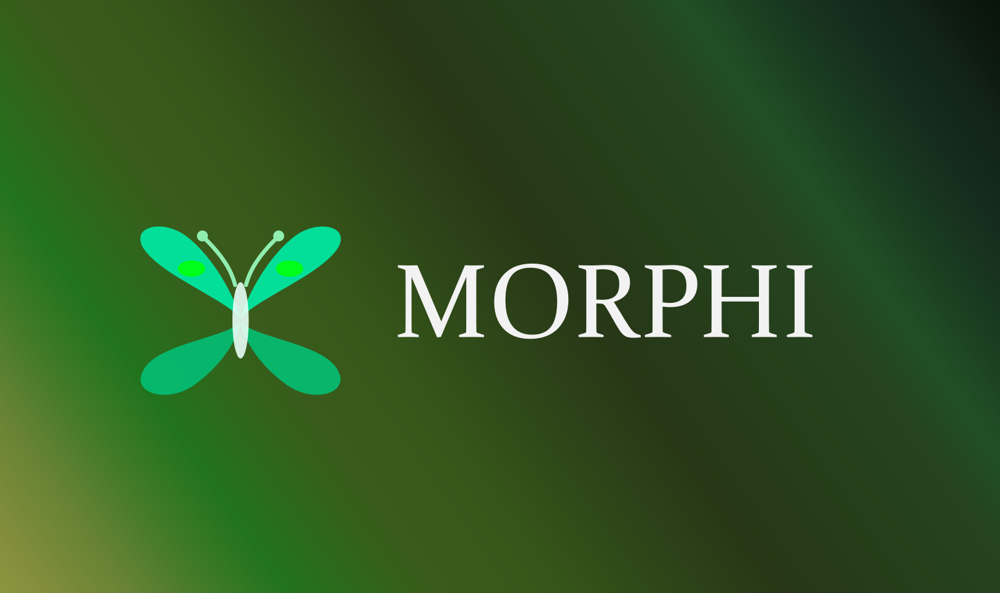

# Morphi



AI-powered coaching for physical activities. Record a short video of your basketball shot, golf swing, guitar strumming, or dance move, describe what you want to improve, and get real-time feedback with visual overlays and voice narration. All built on a custom Lora trained version of Qwen3.

Built at [HackIllinois 2026](https://hackillinois.org).

### How It Works

1. **Record:** The user records up to 5 seconds of video and selects an activity type (basketball shot, golf swing, etc.).
2. **Upload:** The video is sent as `multipart/form-data` to the Modal backend.
3. **Pose Detection:** MediaPipe / YOLO extracts 17-keypoint skeleton data frame-by-frame and identifies the peak-action frame where a mistake occurs.
4. **VLM Analysis:** The mistake frame image and YOLO keypoint coordinates are sent to Qwen3-VL-32B, which generates a biomechanical correction grounded in the exact joint positions.
5. **Voice Feedback:** The coaching text is sent to ElevenLabs TTS to produce a natural voice narration.
6. **Playback:** The app plays the video, pauses at the mistake timestamp, renders SVG overlays showing current vs. target joint positions, and plays the voice coaching.
7. **Progress:** The user sees a progress score and can retry to track improvement over time.

## Overview

Morphi is a mobile app that turns your phone into a personal sports coach. Point your camera at yourself practicing any physical activity -- a basketball free throw, a yoga pose, a golf swing -- and the app tells you exactly what to fix, shows you where on your body to adjust, and speaks the correction out loud.

Under the hood, this is a full-stack ML system:

- A **React Native (Expo)** frontend handles video capture, SVG overlay rendering, and voice playback.
- A **serverless GPU backend on Modal** runs pose estimation (YOLO26x-pose) and a **custom fine-tuned Qwen3-VL-32B** vision-language model to generate spatially-grounded coaching feedback.
- We built an **automated data curation pipeline** that distills coaching knowledge from Gemini 3.0 Flash into ~2,300 labeled examples, then trained a [**LoRA adapter**](https://huggingface.co/Playbird12/motioncoach-qwen3vl-32b-lora) **on 8x H200 GPUs** to specialize the model for biomechanical correction.
- Feedback is structured as machine-readable JSON with `ANGLE_CORRECTION` vectors tied to YOLO keypoints, enabling the app to render precise visual overlays (current joint angle vs. target) directly from model output.
- **ElevenLabs TTS** converts the coaching text into natural voice narration for a hands-free experience.

The key insight is that pose detection alone can tell you _where_ joints are, but not _what's wrong_ or _how to fix it_. By combining skeleton data with a fine-tuned VLM, we bridge the gap between raw pose estimation and actionable coaching.

## Demo

```
Onboarding → Set Goal → Record (≤5s) → AI Analyzes → Playback with Overlays + Voice → Results & Score → Retry / Track Progress
```

## Frontend Features

### Onboarding

A first-time welcome screen where users create an account with a display name and email. The app remembers the account locally via AsyncStorage and skips onboarding on subsequent launches.

### Activity Selection & Focus Description

On the home screen, users pick an activity type from preset chips (Basketball Shot, Golf Swing, Badminton Smash, Tennis Serve, Guitar Chord, Dance Move) or type a custom one. An optional multiline text field lets users describe a specific area to focus on (e.g., "I want to keep my elbow higher on the follow-through").

### Voice Coach Selection

Users choose from five AI coach voices — each with a distinct personality. The selected voice is used for all spoken feedback during playback.

### Video Recording with Countdown

The recording screen opens a full-screen camera with a 3-second "Get ready!" pre-countdown, then records up to 5 seconds with a visible timer. Users can flip between front and back cameras and cancel during the countdown. An activity badge at the top confirms what they're recording.

### Analysis Progress

While the backend processes the video, an animated loading screen shows seven discrete stages (uploading, pose detection, AI analysis, generating feedback, voice synthesis, building overlays, finalizing) with a progress bar and spinning geometric animation.

### Coaching Playback with Timed Overlays

The playback screen syncs AI feedback to the video timeline. At each feedback timestamp the video pauses and displays a two-step coaching overlay:

1. **Coach Says** — a text card with the coaching script and a "Show Corrected Frame" button.
2. **Frame View** — an SVG overlay drawn directly on the paused frame, showing current vs. target joint positions with angle arcs, correction vectors, and degree labels.

The AI voice narration plays automatically at each pause point. A bottom bar shows "Watching your form…" during playback and switches to "View Results" when all feedback has been presented.

### Visual Overlay Engine

The `SVGOverlay` component renders three types of corrections on the video frame using `react-native-svg`:

- **Angle Corrections** — red (current) and green (target) vectors radiating from a joint, with an arc and degree label showing the adjustment needed.
- **Position Markers** — focus circles highlighting specific body parts.
- **Path Traces** — curved motion paths for trajectory corrections.

All coordinates are normalized (0–1) and scaled to the video layout at render time.

### Session Results

After playback, the complete screen shows:

- A **grade pill** (Elite / Good / Progress / Keep Going) based on the form score.
- An **animated score bar** (0–100) with improvement delta compared to the last attempt.
- A **positive note** highlighting what the user did well.
- **Feedback cards** organized by severity tabs (Major, Intermediate, Minor), each with a button to replay the AI voice clip for that correction.
- **Try Again** (re-records with the previous analysis context for comparison) and **New Session** actions.

### Goal Tracking

Users can create named goals from the home screen (e.g., "Fix my free-throw arc"). Each goal is tied to an activity type and persists locally. The home screen displays goal cards showing the activity type, goal name, session count, latest score, and improvement delta since the last session.

### Goal Detail & Progression Chart

Tapping a goal card opens a detail screen with:

- **Stats row** — total sessions, latest score, and personal best.
- **Progression chart** — an SVG line chart plotting the form score across all sessions, with color-coded dots (green for improvement, red for regression, teal for first attempt) and score labels.
- **Session history** — a chronological list of every session with its score and delta.
- A **Start New Session** button to record again for that goal.
- **Delete goal** with a confirmation dialog.

### Design System

The app uses a dark theme (`#16161F` background) with teal (`#00E5A0`) as the primary accent. Consistent design tokens for spacing, border radius, typography, and card styles are defined in `app/styles/theme.ts` and shared across all screens.

## Running the App

### Prerequisites

- [Node.js](https://nodejs.org/) (v18+)
- [Expo CLI](https://docs.expo.dev/get-started/installation/) (`npm install -g expo-cli`)
- [Python 3.13+](https://www.python.org/) with [uv](https://docs.astral.sh/uv/)
- A [Modal](https://modal.com/) account
- Android/iOS device or emulator (Expo Go works for quick testing)

### Frontend (React Native / Expo)

```bash
npm install
npm start
```

This launches the Expo dev server. From there:

- Press `a` to open on a connected Android device/emulator
- Press `i` to open on iOS simulator
- Press `w` to open in the browser
- Scan the QR code with the Expo Go app on your phone

By default, the app points at the deployed Modal backend. To run in **mock mode** (no backend needed), set `MODAL_API_URL = null` in `app/services/api.ts`.

### Backend (Modal — Serverless GPU)

The backend runs on [Modal](https://modal.com/) with serverless GPU containers. There is no traditional local dev server; you deploy to Modal and the app calls it over HTTPS.

```bash
cd backend
uv sync
```

Set up Modal secrets (one-time):

```bash
modal secret create huggingface-secret HF_TOKEN=<your-hf-token>
modal secret create custom-secret elevenlabs=<your-elevenlabs-key>
```

Deploy the backend:

```bash
modal deploy backend.py
```

This gives you two endpoints:

- `POST /analyze` — upload a video and receive coaching feedback
- `GET /get_video` — stream the annotated video back

Update `MODAL_API_URL` in `app/services/api.ts` with your deployment URL.

### Fine-Tuning Pipeline (Optional)

See [`backend/modal_fine_tuning/README.md`](backend/modal_fine_tuning/README.md) for the full setup guide.

```bash
cd backend/modal_fine_tuning

# Step 1: Generate labeled dataset from Kaggle sports images (~15-30 min)
uv run modal run data_acquisition.py

# Step 2: Fine-tune with LoRA on 8x H200 GPUs (~30-90 min)
uv run modal run training.py
```

### Running Tests

```bash
npm test
```

## Custom Model: Data Curation & Training

### The Problem

General-purpose VLMs like Qwen3-VL-32B can describe what they see in an image, but they lack the domain expertise to provide **actionable biomechanical coaching** -- the kind of structured, spatially-grounded feedback that tells an athlete exactly which joint to adjust, by how much, and why. We needed to teach the model to think like a sports coach.

### Data Curation Pipeline

We built an automated pipeline that creates high-quality pose correction training data at scale:

**1. Multi-source image collection.** We aggregated images from multiple Kaggle datasets spanning 17+ activity categories: sports (badminton, basketball, tennis, cricket, gymnastics, etc.), yoga poses, and workout exercises. This diversity ensures the model generalizes across movement types rather than overfitting to a single sport.

**2. YOLO26x-pose filtering.** Every image is passed through YOLO26x-pose on GPU. We enforce strict quality gates: exactly one person detected, at least 3 visible keypoints with confidence > 0.3. Multi-person scenes, occluded athletes, and non-person images are discarded. This runs in parallel (one T4 GPU per sport category) for speed.

**3. Gemini 3.0 Flash distillation.** Each filtered image, along with its YOLO keypoint coordinates, is sent to Gemini 3.0 Flash (with structured JSON output mode) to generate coaching labels. The prompt requires Gemini to produce:

- A **progress score** (0-100) grading overall form quality
- A **positive note** highlighting what the athlete does well
- 1-5 **feedback points**, each with a coaching script and precise **ANGLE_CORRECTION** visual overlays (current vs. target vectors anchored to YOLO keypoint coordinates)

This is knowledge distillation: we use a frontier model (Gemini) as the teacher to generate thousands of expert-quality labels, then train our own model to reproduce and internalize that expertise.

**4. Quality validation.** Every Gemini response is parsed and validated against the coaching JSON schema before inclusion. Malformed or incomplete responses are discarded. The final dataset contains ~2,300 validated training examples.

### Why This Approach

- **Scalable labeling.** Manual annotation of biomechanical coaching data would require domain experts and weeks of effort. Gemini distillation produces thousands of labels in under 30 minutes.
- **Spatially grounded.** By including YOLO keypoint coordinates in both the prompt and the expected output, the model learns to anchor its feedback to precise body locations rather than giving vague advice.
- **Structured output.** The JSON schema with `ANGLE_CORRECTION` vectors enables the frontend to render visual overlays directly from model output -- no post-processing needed.

### Training Architecture

| Decision                 | Choice                                             | Rationale                                                                                                          |
| ------------------------ | -------------------------------------------------- | ------------------------------------------------------------------------------------------------------------------ |
| **Base model**           | Qwen3-VL-32B-Instruct                              | Best open-source VLM at 32B scale with native image understanding                                                  |
| **Adaptation method**    | LoRA (rank 256, alpha 512)                         | Parameter-efficient fine-tuning -- adapts ~1% of parameters while preserving base capabilities                     |
| **LoRA dropout**         | 0.05                                               | Regularization to prevent overfitting on ~2,100 training examples                                                  |
| **Vision encoder**       | Unfrozen (ViT + aligner)                           | Allows the model to learn pose-specific visual features rather than relying on generic pre-trained representations |
| **Hardware**             | 8x NVIDIA H200 (141 GB VRAM each)                  | 1.1 TB total GPU memory enables full model loading with DDP                                                        |
| **Distributed strategy** | PyTorch DDP via `torchrun`                         | Simple, reliable multi-GPU training without the complexity of DeepSpeed/FSDP                                       |
| **LR schedule**          | Cosine (1e-4 peak, 10% warmup)                     | Smooth decay produces better final convergence than linear                                                         |
| **Effective batch size** | 64 (2/device x 4 grad accum x 8 GPUs)              | Large batch for stable gradient estimates                                                                          |
| **Epochs**               | 10                                                 | Small dataset needs multiple passes to converge fully                                                              |
| **Validation**           | 10% held-out split, evaluated every 25 steps       | Early stopping signal to select the best checkpoint                                                                |
| **Framework**            | [MS-Swift](https://github.com/modelscope/ms-swift) | Handles Qwen3-VL's multi-modal data format natively                                                                |

The LoRA adapter is automatically downloaded locally after training and can optionally be uploaded to Hugging Face Hub. See [`backend/modal_fine_tuning/README.md`](backend/modal_fine_tuning/README.md) for full setup instructions.

## Technical Overview

### Architecture

```
┌───────────────────┐         ┌───────────────────────────────────────────┐
│   React Native    │  HTTPS  │              Modal (GPU)                  │
│   (Expo)          │◄───────►│                                           │
│                   │         │  ┌──────────────┐   ┌──────────────────┐  │
│  expo-camera      │         │  │ MediaPipe /  │──►│  Qwen3-VL-32B    │  │
│  expo-av          │         │  │ YOLO Pose    │   │  (VLM Reasoning) │  │
│  react-native-svg │         │  └──────────────┘   └──────────────────┘  │
│                   │         │                  ┌──────────────────┐     │
│                   │         │                  │  ElevenLabs TTS  │     │
└───────────────────┘         │                  └──────────────────┘     │
                              └───────────────────────────────────────────┘
```

### Stack

| Layer                 | Technology                                   |
| --------------------- | -------------------------------------------- |
| Client                | React Native (Expo 54), TypeScript, React 19 |
| Navigation            | React Navigation 7 (native-stack)            |
| Media                 | expo-camera, expo-av, react-native-svg       |
| Backend               | Modal (Python, serverless GPU)               |
| Pose Detection        | MediaPipe / YOLO pose estimation             |
| Vision-Language Model | Qwen3-VL-32B-Instruct via vLLM ([LoRA adapter](https://huggingface.co/Playbird12/motioncoach-qwen3vl-32b-lora)) |
| Text-to-Speech        | ElevenLabs API                               |
| Fine-Tuning           | MS-Swift LoRA SFT on 8x H200 GPUs via Modal  |

### Project Structure

```
├── App.tsx                        # Entry point, navigation stack, dark theme
├── app/
│   ├── screens/
│   │   ├── OnboardingScreen.tsx   # First-time account creation (name + email)
│   │   ├── HomeScreen.tsx         # Dashboard: activity/voice selection, goals, start recording
│   │   ├── RecordingScreen.tsx    # Camera capture with 3s countdown + 5s recording limit
│   │   ├── AnalyzingScreen.tsx    # 7-stage animated progress during backend analysis
│   │   ├── PlaybackScreen.tsx     # Video + timed coaching overlays + voice narration
│   │   ├── CompleteScreen.tsx     # Grade pill, score bar, severity-tabbed feedback cards
│   │   └── GoalDetailScreen.tsx   # Progression chart, session history, stats
│   ├── components/
│   │   └── SVGOverlay.tsx         # Renders angle corrections, position markers, path traces
│   ├── services/
│   │   ├── api.ts                 # Modal API client with mock fallback
│   │   ├── accountStore.ts        # AsyncStorage-backed user account persistence
│   │   └── goalStore.ts           # AsyncStorage-backed goal & session tracking
│   ├── styles/
│   │   └── theme.ts               # Dark theme tokens: colors, spacing, typography
│   └── types/
│       └── index.ts               # TypeScript type definitions
├── backend/
│   ├── backend.py                 # Modal app: /analyze and /get_video endpoints
│   ├── pyproject.toml             # Python dependencies (uv)
│   └── modal_fine_tuning/
│       ├── data_acquisition.py    # Kaggle download, YOLO filtering, Gemini distillation
│       └── training.py            # LoRA fine-tuning on 8x H200 GPUs via Modal
```

## AI Tools Disclosure

As required by HackIllinois policy, here is a full disclosure of AI tools used in this project:

- **Cursor (Claude):** Used for code generation assistance, debugging, and writing documentation throughout development.
- **Qwen3-VL-32B-Instruct:** Core vision-language model running on Modal GPUs. Analyzes pose images with YOLO keypoint data to generate biomechanical coaching feedback. This is a central, novel component of the product, not a wrapper.
- **Gemini API:** Used in the fine-tuning data pipeline (`data_acquisition.py`) to generate coaching labels for training images. Not used at inference time.
- **ElevenLabs:** Converts coaching text to natural speech for the voice feedback feature.
- **MediaPipe / YOLO:** Pose estimation models for extracting skeleton keypoints from video frames.

The project's core value is the novel integration of pose detection with vision-language reasoning to deliver real-time, personalized coaching feedback with visual overlays — not a thin wrapper around any single AI tool.
